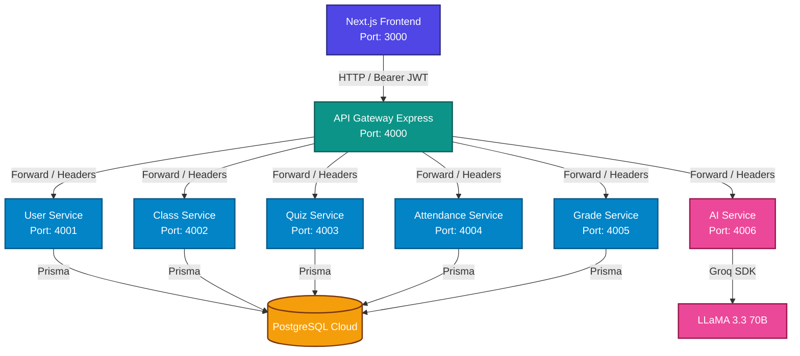

# 🎓 Tóm Tắt Dự Án: S-Class - Microservices Architecture

Dự án **S-Class** là một ứng dụng quản lý lớp học trực tuyến được thiết kế và triển khai theo mô hình kiến trúc **Microservices (Service-Oriented Architecture - SOA)**. Hệ thống phân rã các nghiệp vụ thành các dịch vụ độc lập nhằm tối ưu hóa khả năng mở rộng, bảo trì và triển khai độc lập.

---

## 📊 Sơ Đồ Kiến Trúc Hệ Thống

Dưới đây là mô hình luồng dữ liệu và tương tác giữa các thành phần trong hệ thống:



---

## 🔑 Luồng Xác Thực (Authentication Flow)

Hệ thống sử dụng cơ chế xác thực tập trung thông qua **Clerk Auth** và xác thực phân tán bằng JWT token tại API Gateway:

```
┌──────────┐          1. Đăng nhập / Nhận JWT          ┌────────────┐
│ Frontend ├──────────────────────────────────────────>│ Clerk Auth │
│ (Next.js)│<──────────────────────────────────────────┤  Service   │
└────┬─────┘             Trả về JWT Token              └────────────┘
     │
     │ 2. Request + Bearer Token (JWT)
     ▼
┌─────────────┐
│ API Gateway │ 3. Xác thực JWT (RS256) và giải mã thông tin User
│  (Port 4000)│ 
└────┬────────┘
     │
     │ 4. Forward Request kèm theo Custom Headers:
     │    - x-user-clerk-id: ID người dùng từ Clerk
     │    - x-user-email: Email người dùng
     ▼
┌──────────────┐
│ Microservice │ 5. Đọc thông tin từ Header và thực thi nghiệp vụ
│ (4001 - 4005)│    (Không cần xác thực lại JWT)
└──────────────┘
```

---

## 🧩 Chi Tiết Các Microservices

Hệ thống áp dụng pattern **Database-per-Service**, mỗi service sử dụng cơ sở dữ liệu riêng của mình thông qua Prisma ORM:

| Tên Dịch Vụ | Cổng (Port) | Vai Trò & Nghiệp Vụ Chính | Cơ Sở Dữ Liệu (Các Bảng Chính) |
| :--- | :---: | :--- | :--- |
| **API Gateway** | `4000` | Điều hướng (Routing), Xác thực JWT (Auth), cấu hình CORS, Logging. | Không dùng DB |
| **User Service** | `4001` | Đồng bộ dữ liệu người dùng từ Clerk, quản lý hồ sơ cá nhân. | `User` |
| **Class Service** | `4002` | Tạo/quản lý lớp học, thành viên lớp, chia sẻ tài liệu và bảng tin thông báo. | `Class`, `ClassMember`, `Announcement`, `Document` |
| **Quiz Service** | `4003` | Tạo bài trắc nghiệm, ngân hàng câu hỏi, ghi nhận bài nộp và thống kê điểm số. | `Quiz`, `QuizQuestion`, `QuizSubmission` |
| **Attendance Service** | `4004` | Quản lý điểm danh, tạo phiên điểm danh bằng mã QR. | `AttendanceSession`, `AttendanceRecord` |
| **Grade Service** | `4005` | Quản lý môn học, cấu trúc trọng số điểm (Grade Components), cập nhật bảng điểm học sinh. | `Subject`, `GradeComponent`, `Grade` |
| **AI Service** | `4006` | Trợ lý học tập (Chatbot), tự động sinh đề kiểm tra (Quiz Generator) từ tài liệu. | Không dùng DB (Stateless) |

---

## 🛠 Công Nghệ Sử Dụng (Tech Stack)

> [!NOTE]
> Các công nghệ được lựa chọn giúp tối ưu hiệu năng phát triển nhanh và khả năng vận hành độc lập giữa các thành phần.

*   **Frontend**: Next.js 14, React, TailwindCSS, Clerk Authentication Client.
*   **API Gateway**: Express.js, `http-proxy-middleware` để định tuyến request.
*   **Backend Services**: Node.js, Express.js, TypeScript.
*   **Database & ORM**: PostgreSQL (lưu trữ trên hạ tầng Neon Cloud), kết nối qua Prisma ORM.
*   **Trí tuệ nhân tạo (AI)**: Groq SDK tích hợp model mã nguồn mở LLaMA 3.3 70B cho phản hồi cực nhanh.
*   **DevOps & Container**: Docker, Docker Compose phục vụ môi trường chạy thử và deploy.

---

## 📁 Cấu Trúc Dự Án

```
study-microservices/
├── gateway/                  # Mã nguồn API Gateway
│   ├── src/
│   │   ├── index.ts          # Điểm khởi chạy Gateway server
│   │   ├── proxy.ts          # Định tuyến map URLs tới các service
│   │   └── auth-middleware.ts # Middleware xác thực JWT token từ Clerk
│   └── Dockerfile
│
├── services/                 # Thư mục chứa các Microservices
│   ├── user-service/         # Quản lý người dùng
│   ├── class-service/        # Quản lý lớp học & tài liệu
│   ├── quiz-service/         # Quản lý bài tập & bài kiểm tra
│   ├── attendance-service/   # Quản lý điểm danh học viên
│   ├── grade-service/        # Quản lý cấu trúc điểm số
│   └── ai-service/           # Tích hợp AI LLaMA 3.3
│
├── frontend/                 # Ứng dụng Next.js Client
├── shared/                   # Các hàm tiện ích dùng chung (Utilities, Types)
├── docker-compose.yml        # File orchestrate chạy đồng thời qua Docker
├── .env                      # File cấu hình biến môi trường
└── README.md                 # Hướng dẫn dự án gốc
```

---

## 🚀 Hướng Dẫn Vận Hành

### Chạy trực tiếp dưới máy local (Development)

1.  **Cài đặt dependencies** cho toàn bộ các thư mục (gốc, gateway, frontend và từng service):
    ```bash
    npm run install:all
    ```
2.  **Sinh mã Prisma Client** cho các service sử dụng Database:
    ```bash
    npm run prisma:generate
    ```
3.  **Khởi chạy toàn bộ Services & Gateway** đồng thời:
    ```bash
    npm run dev
    ```
4.  **Mở terminal mới và khởi chạy ứng dụng Frontend**:
    ```bash
    npm run dev:frontend
    ```

### Chạy bằng Docker Compose

Để kiểm tra hệ thống hoạt động thống nhất trong môi trường Container:
```bash
# Build và start toàn bộ container
docker-compose up --build

# Tắt hệ thống container
docker-compose down
```

---
*Tài liệu tóm tắt được tạo vào lúc 21:50 ngày 19/06/2026.*
